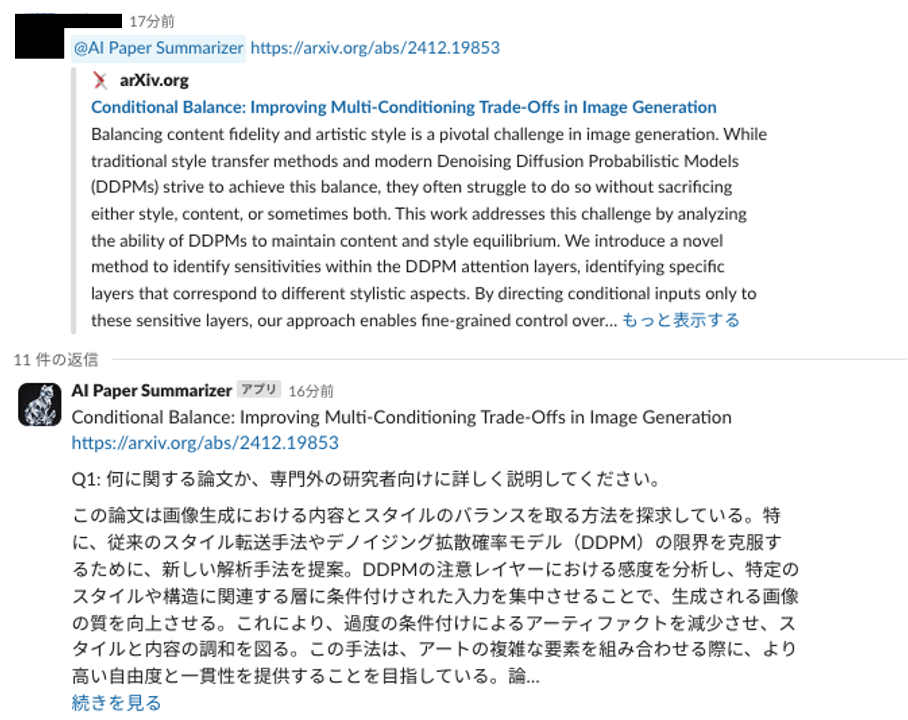
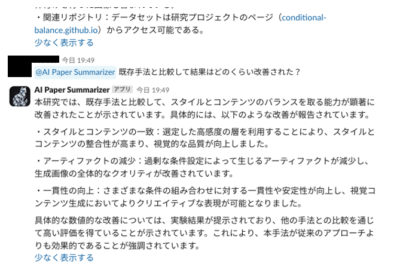

# 🤖 AI-paper-summarizer

このリポジトリは、研究論文や技術文書などを要約して Slack へ送信、さらに成果を Notion へ保存するなどの機能を提供する「AI Paper Summarizer」アプリケーションのソースコードです。

## 目次

- [特徴 (Features)](#特徴-features)
- [使い方 (Usage)](#使い方-usage)
- [ディレクトリ構成 (Directory Structure)](#ディレクトリ構成-directory-structure)
- [インストール (Installation)](#インストール-installation)
- [主な機能 (Main Features)](#主な機能-main-features)
- [CI/CD (GitHub Actions)](#cicd-github-actions)

---

## 特徴 (Features)

1. **論文要約機能**

   - 研究論文を背景、新規性、方法、成果、限界など、複数の観点から包括的に要約可能
   - 大規模言語モデル (LLM) を利用した高度な自然言語解析により、要点を的確にまとめる

2. **チャット機能**

   - 汎用的なチャットインタラクションをサポートし、論文内容や関連情報の Q&A が可能
   - ノンコーディングユーザーでも簡単に操作できるインタフェースを提供
   - ChatGPT 互換のメッセージ形式で、会話の文脈を保持した応答を生成

3. **Notion 保存機能**
   - 要約結果や抽出した情報を Notion データベースに直接保存
   - Notion API を利用して必要な情報を指定フォーマットで登録し、知識管理に活用
   - 後から検索や編集を行いやすく、チームでの共同作業も容易

---

## 利用方法 (Usage)

> **Slack での論文要約**<br>
テキストを Slack に投稿すると、AI が内容を解析して論文の要約を生成します。

<p align="center">
  
</p>

> **Slack での QA**<br>
Slack 上でチャット形式のやり取りが可能です。論文の詳細や疑問点などを対話的に質問できます。

<p align="center">
  
</p>

> **Notion Database への保存**<br>
要約結果やメタ情報を Notion Database に自動保存します。後から簡単に検索・閲覧・編集が可能です。

<p align="center">
  
</p>


## ディレクトリ構成 (Directory Structure)

```
AI-paper-summarizer/
├── pyproject.toml
├── poetry.lock
├── requirements.txt
├── makefile
├── README.md
├── src
│   ├── application
│   │   └── slack_handler.py
│   ├── dependency_injector
│   ├── domain
│   │   ├── models.py
│   │   └── services.py
│   ├── infrastructure
│   │   ├── file_downloader
│   │   │   └── file_downloader.py
│   │   ├── llm
│   │   │   ├── _types.py
│   │   │   ├── llm.py
│   │   │   └── utils.py
│   │   ├── notion
│   │   │   └── notion.py
│   │   └── slack
│   │       └── slack.py
│   └── lambda_function.py
└── tests
```

## インストール (Installation)

1. リポジトリのクローン

```bash
$ git clone git@github.com:hanoi0126/AI-paper-summarizer.git
$ cd AI-paper-summarizer
```

2. 依存関係のインストール

```bash
$ poetry install
```

## CI/CD (GitHub Actions)

GitHub Actions で以下を自動化しています。

- Lint チェック: ruff による静的解析
- タイプチェック: mypy による型チェック
- ユニットテスト: pytest
- GitHub OIDC と AWS IAM ロール連携: デプロイや各種リソース操作時に利用する
